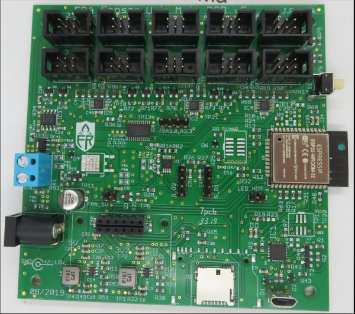
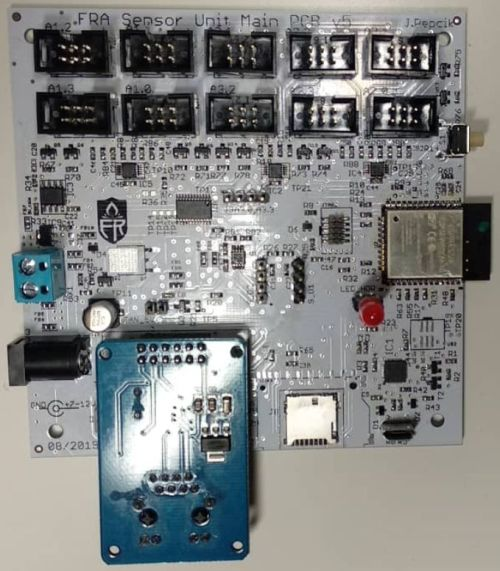

# FRA Sensor platform
Analog and Digital datalogger with 16 analog channels (16bit) with programmable gain amplifier (auto ranged from 0-256mV to 0-5V).

# Main board picture

# Development tools
Built on ESP32 module and Arduino framework using Platformio IDE.

# Firmware download to ESP32
https://www.espressif.com/en/products/hardware/esp32/resources

Tools -> Flash Download Tool

Built binary files with the guide are located here:

https://github.com/Yourigh/FRA_Sensor_platform/tree/master/3-FW_SW/1-FW_device/Programming_procedure

Update the esptool.py to newest from:

https://github.com/espressif/esptool

# Resources
https://github.com/greiman/SdFat

https://github.com/jrowberg/i2cdevlib/tree/master/Arduino/ADS1115

https://github.com/8-DK/EtherCard
